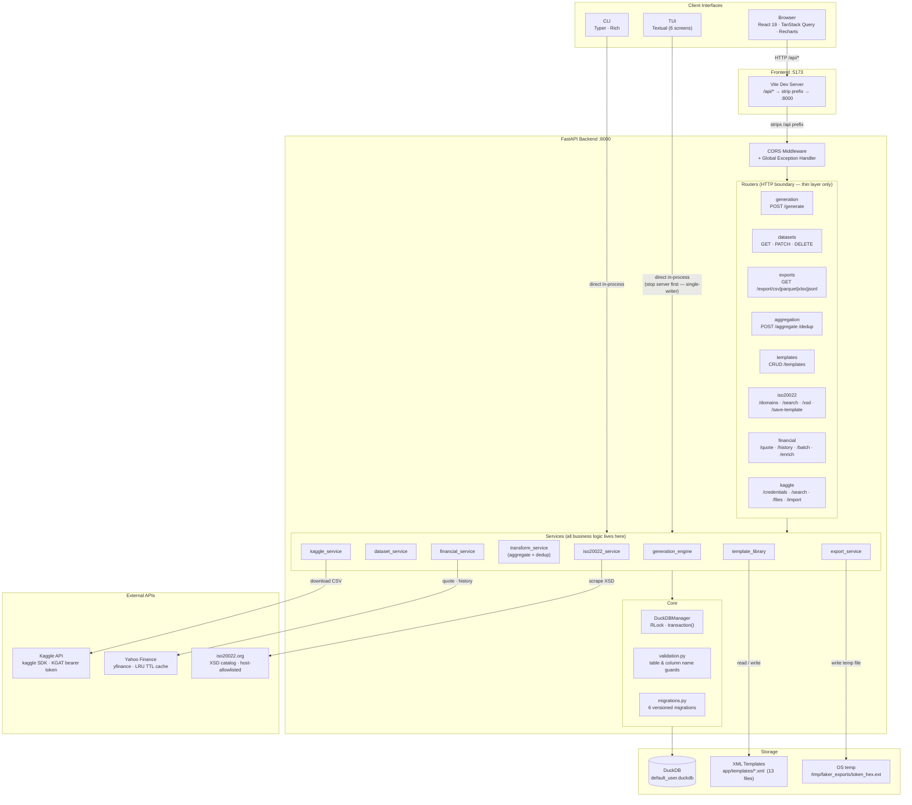
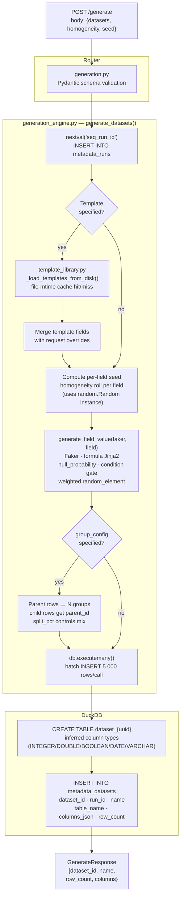
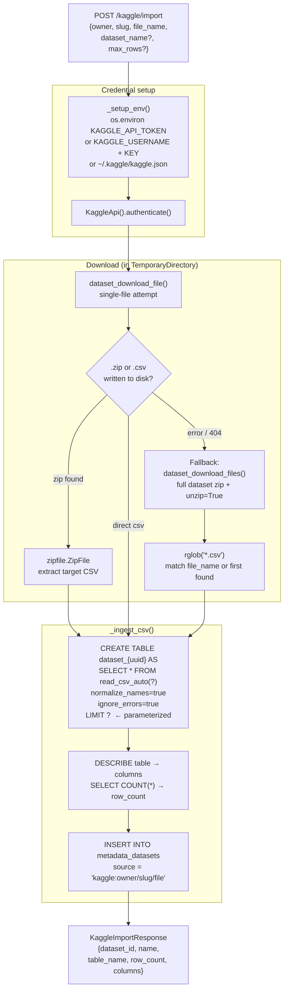
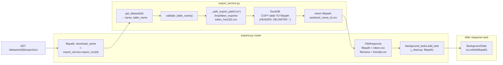
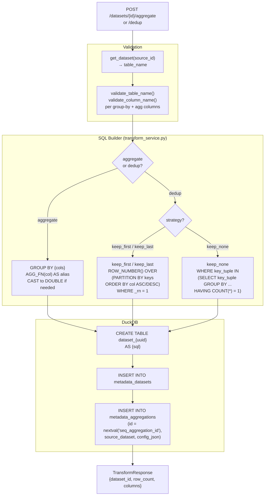
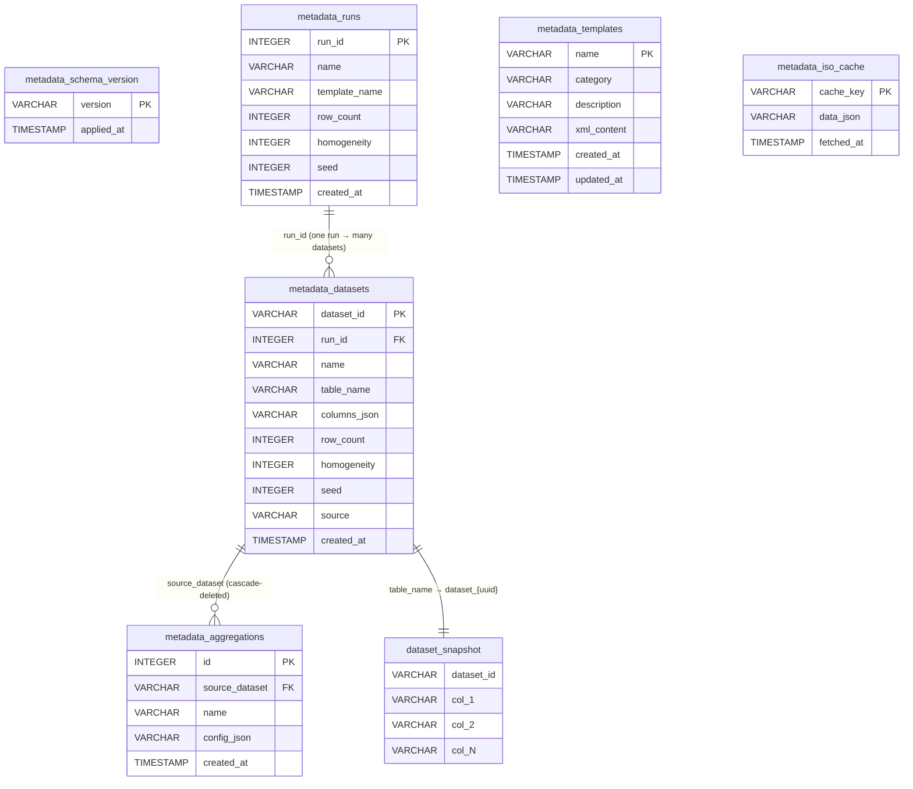

# Architecture Diagrams

## 1. System Architecture

High-level component view — how the three client interfaces connect through to storage and external APIs.

---

## 2. Data Flows

### 2a. Dataset Generation Pipeline

---

### 2b. Kaggle Import Pipeline

---

### 2c. Export Pipeline

---

### 2d. Aggregation & Dedup Pipeline

---

## 3. Database Schema

> **`dataset_snapshot`** is a placeholder for the family of dynamic tables named `dataset_{uuid4}`. Each row in `metadata_datasets` maps to exactly one such table via the `table_name` column. These tables are immutable after creation — aggregation and dedup always produce a new `dataset_{uuid}` table.

### Sequences

| Sequence | Used by | Purpose |
|---|---|---|
| `seq_run_id` | `metadata_runs.run_id` | Monotonic run counter |
| `seq_aggregation_id` | `metadata_aggregations.id` | Monotonic aggregation counter (separate to avoid collisions with runs) |

### Migration history

| Migration | What it adds |
|---|---|
| `001_initial_schema` | `seq_run_id` · `metadata_templates` · `metadata_runs` · `metadata_aggregations` · `metadata_datasets` |
| `002_iso_cache` | `metadata_iso_cache` |
| `003_indexes` | Indexes on `metadata_datasets(name)` and `metadata_datasets(created_at DESC)` |
| `004_template_runs_relation` | `metadata_runs.template_name` column |
| `005_dataset_source` | `metadata_datasets.source` column |
| `006_aggregation_sequence` | `seq_aggregation_id` sequence |
